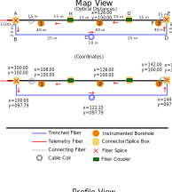
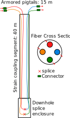

:::{.callout-warning}
This example is still under development; don't read too closely yet.
:::

This example details a deployment in an underground tunnel. The theoretical objective is to discover any instabilities in the floor of the tunnel, perhaps from other excavations, using DSS, and detect seismic activity with DAS.

The fiber array initially consists of three boreholes, a trench, and coiled cable along the side of the tunnel, as seen in figure (@fig-mine-deployment).

{#fig-mine-deployment fig-cap="Simple fiber deployment."}

The telemetry cable is a basic 4-fiber tight-buffered telecom cable, such as [Corning MIC Tight-Buffered Cable, 4 F, single-mode OS2](https://ecatalog.corning.com/optical-communications/US/en/Products/Fiber-Optic-Cables/Tight-Buffered/MIC%C2%AE-Tight-Buffered-Cable%2C-Plenum/p/mic-tight-buffered-cable-plenum?variant=fiber-count-4).

The boreholes are instrumented with [Nerve-Sensors Epsilon-style cable](../svg/examples/borehole_fiber.svg) with 4 single-mode fibers, and a turnaround enclosure at the bottom (where fibers are spliced back on each other to create continuous, down-and-back optical loops). See @fig-borehole-fiber. 40 m of the fiber contains the rock-coupling coating, while the parts above the hole are armored pigtails. We assume this transition was naturally made as part of the cable manufacturing and that no splice exists between the two segments. Also, the pigtails have E2000 APC connectors and are connected with E2000 couplers.

{#fig-borehole-fiber fig-cap="Borehole fiber used in the tunnel deployment." width="30%"}

The trenched cable is modeled as a helically wound DAS sensing cable, such as the [Silixa specialty HWC cable shown in their CCUS monitoring white paper](https://silixa.com/wp-content/uploads/CCUS_White_Paper.pdf) (Figures 9 and 10). That reference describes HWC specialty cables for near-surface installations and shows an example with a fiber wind angle ($phi$) of 30 degrees off-axis to increase broadside seismic sensitivity. The 30-degree winding also means optical distance along the fiber ($d_o$) is longer than the actual trench-axis distance ($d_r$), with the approximate relationship being:

$$
d_r \approx d_o \cos \phi \approx 0.866 d_o
$$

There is a buried cable loop of approximately 10 m with a diameter of 1 m designed to be a horizontally sensitive "clump" sensor.

In total, there are two optical paths: one intended for a Febus G1 Brillouin DSS system (called PDSS) and the other for a Sintela Onyxia DAS Rayleigh interrogator (called PDAS).

## Deployment tables

First, we start by summarizing the deployment with several tables, the sort that might be extracted from field notes.

### Optical component table

### Coordinate table

### Coupling condition table
